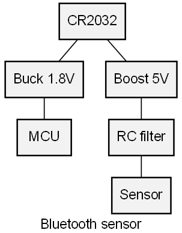

# Welcome to sysLoss
`sysLoss` is a tool for analyzing system power and losses. From the smallest IoT sensor to large industrial installations. The tool is efficient and easy to use, the analysis result provides a detailed report on voltages, currents, power and efficiency for every component defined in the system. Output format is Pandas DataFrame: Create charts, plots and export to Excel and other formats. 

## Installation
To get started with *sysLoss*, install the python package from PyPI with:
```bash
$ pip install sysloss
```
Upgrade to the latest release with:
```bash
$ pip install --upgrade sysloss
```

Or install with conda:
```bash
$ conda install conda-forge::sysloss
```

## First system model
A simple, battery-powered Bluetooth sensor can be defined as simple as this:
```python
from sysloss.components import *
from sysloss.system import System

bts = System("Bluetooth sensor", Source("CR2032", vo=3.0, rs=10))
bts.add_comp("CR2032", comp=Converter("Buck 1.8V", vo=1.8, eff=0.87))
bts.add_comp("Buck 1.8V", comp=PLoad("MCU", pwr=13e-3))
bts.add_comp("CR2032", comp=Converter("Boost 5V", vo=5.0, eff=0.82))
bts.add_comp("Boost 5V", comp=RLoss("RC filter", rs=6.8))
bts.add_comp("RC filter", comp=ILoad("Sensor", ii=6e-3))
bts.tree()
```
```
Bluetooth sensor
└── CR2032
    ├── Boost 5V
    │   └── RC filter
    │       └── Sensor
    └── Buck 1.8V
        └── MCU
```
```python
bts.solve()
```


`sysLoss` can also produce graphical power tree diagrams:
```python
import sysloss.diagram as sd

sd.make_diag(bts, fname="bts.png")
```


## Next step
The best way to learn `sysLoss` is to explore the tutorials section. The tutorials are Jupyter Notebooks that can also be found in the GitHub repository under docs/nb.


```{tableofcontents}
```

